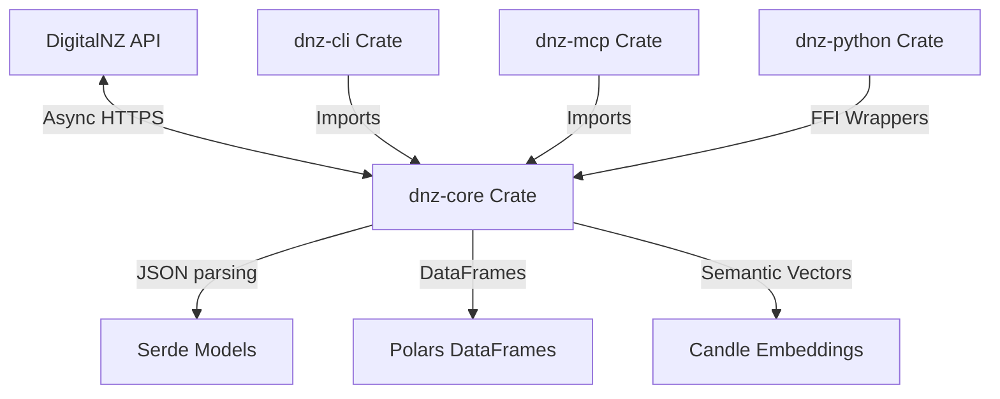

This project leverages a multi-crate Cargo workspace to separate core API logic from interface boundaries and client integrations.

## Directory Layout

```
dnz/
├── Cargo.toml                 # Root workspace manifest
├── pixi.toml                  # Local environment config
├── docs/                      # Astro + Starlight documentation (this portal)
├── .github/                   # CI/CD verification workflows
└── crates/
    ├── dnz-core/              # Library containing core API wrappers
    │   ├── src/
    │   │   ├── client.rs      # HTTP client and backoff retry structures
    │   │   ├── models.rs      # Serde schemas mapping DigitalNZ API JSON
    │   │   ├── dataframe.rs   # Polars data extraction helpers
    │   │   ├── vector.rs      # Offline Candle vector search and cosine math
    │   │   ├── digest.rs      # RAG context formatting XML templates
    │   │   ├── autopilot.rs   # Density-based query partition plan
    │   │   └── lib.rs
    │   └── tests/             # Offline integration tests (wiremock)
    │
    ├── dnz-cli/               # CLI console wrapper application
    │   └── src/
    │       ├── lib.rs
    │       └── main.rs        # CLI argument router
    │
    ├── dnz-mcp/               # Model Context Protocol stdio server
    │   └── src/
    │       └── main.rs        # JSON-RPC protocol loop
    │
    └── dnz-python/            # Maturin-compiled Python FFI bindings
        └── src/
            └── lib.rs         # PyO3 bindings definitions
```

## Internal Module Architecture



## Semantic Model

The Power BI semantic model scaffold lives in `powerbi/semantic-model/DigitalNZ.SemanticModel/definition`.
Its generated data dictionary is available at `docs/src/content/docs/generated/semantic-model-dictionary.md`.
